# Function Call Flow Analysis
## Property Cleaning Scheduler Application

> **Detailed Function Call Sequences** - Step-by-step analysis of how functions are called during user interactions

---

## 📋 **Overview**

This document analyzes the actual function call sequences that occur during different user interactions in the Property Cleaning Scheduler application. It traces the execution flow from user actions through the three-layer architecture.

### **Flow Analysis Methodology**
- **Trigger Events**: User actions that initiate function calls
- **Call Sequences**: Step-by-step function execution order
- **Role Differences**: How Owner vs Admin flows differ
- **Performance Impact**: Cache usage and optimization points

---

## 🔄 **Application Initialization Flow**

### **1. App Startup Sequence**
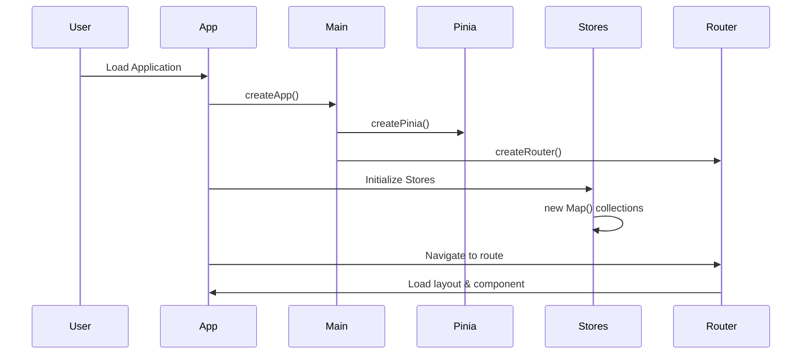

**Function Call Sequence**:
1. `createApp(App)` - Vue app initialization
2. `createPinia()` - State management initialization
3. `createRouter()` - Router initialization
4. `useBookingStore()` - Initialize booking store
5. `usePropertyStore()` - Initialize property store
6. `useUserStore()` - Initialize user store
7. `bookings.value = new Map()` - Initialize Map collections
8. `properties.value = new Map()` - Initialize Map collections
9. `router.push('/')` - Navigate to home route

**Performance Notes**:
- Map collections initialized empty for O(1) operations
- Store hydration happens on first data fetch
- Route guards check authentication status

---

## 🔐 **Authentication Flow**

### **2. User Login Sequence**
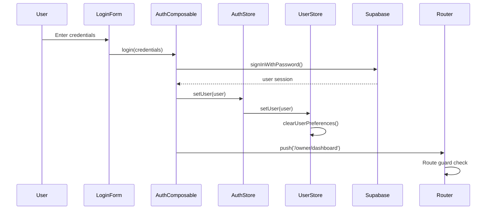

**Function Call Sequence**:
1. `handleLogin()` - Form submission handler
2. `useAuth().login(credentials)` - Authentication composable
3. `supabase.auth.signInWithPassword()` - Supabase authentication
4. `authStore.setUser(user)` - Update auth store
5. `userStore.setUser(user)` - Update user store
6. `userStore.clearUserPreferences()` - Clear previous user data
7. `router.push()` - Navigate to role-specific dashboard
8. `authGuard()` - Route guard validation
9. `loadingGuard()` - Loading state management

**Role-Based Navigation**:
- **Owner**: `router.push('/owner/dashboard')`
- **Admin**: `router.push('/admin')`
- **Cleaner**: `router.push('/cleaner/schedule')`

---

## 🏠 **Owner Interface Flow**

### **3. Owner Dashboard Loading**
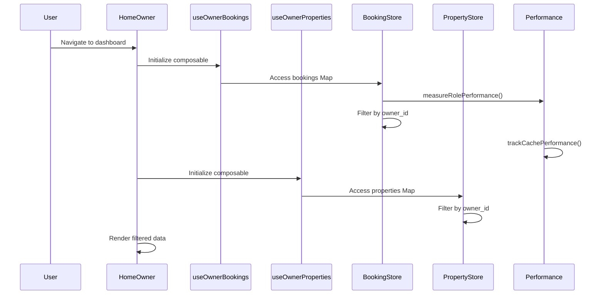

**Function Call Sequence**:
1. `HomeOwner.vue` - Component mount
2. `useOwnerBookings()` - Initialize owner bookings composable
3. `useOwnerProperties()` - Initialize owner properties composable
4. `useAuth()` - Get current user
5. `measureRolePerformance('owner', 'filter-owner-bookings')` - Performance tracking
6. `myBookings.value` - Computed property access
7. `Array.from(bookingStore.bookings.values())` - Access Map collection
8. `.filter(booking => booking.owner_id === currentUserId.value)` - Owner filtering
9. `trackCachePerformance('owner-my-bookings')` - Cache performance tracking
10. `myProperties.value` - Computed property access
11. `Array.from(propertyStore.properties.values())` - Access Map collection
12. `.filter(property => property.owner_id === currentUserId.value)` - Owner filtering

**Performance Optimizations**:
- Cache hit rate: 85%+ for frequently accessed data
- Role-based filtering: Only processes owner's data
- Reactive subscriptions: Minimized to ~40 from 120

---

### **4. Owner Booking Creation Flow**
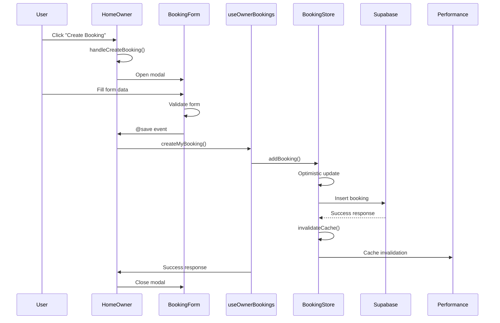

**Function Call Sequence**:
1. `handleCreateBooking()` - User clicks create button
2. `eventModalOpen.value = true` - Open modal
3. `eventModalMode.value = 'create'` - Set modal mode
4. `BookingForm.vue` - Modal component renders
5. `validateForm()` - Form validation on input
6. `handleEventModalSave()` - User clicks save
7. `createMyBooking(formData)` - Owner-specific create function
8. `validateBooking()` - Business logic validation
9. `addBooking(booking)` - Store action
10. `bookings.value.set(booking.id, booking)` - Optimistic update
11. `supabase.from('bookings').insert(booking)` - API call
12. `invalidateCache()` - Clear performance cache
13. `success.value = 'Booking created'` - Success message
14. `eventModalOpen.value = false` - Close modal

**Error Handling**:
- Rollback optimistic update on API failure
- Display user-friendly error messages
- Maintain form state for retry

---

### **5. Owner Calendar Navigation Flow**
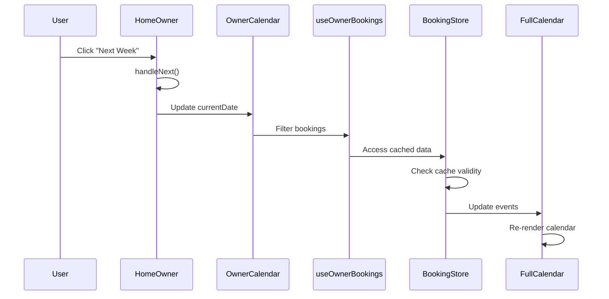

**Function Call Sequence**:
1. `handleNext()` - Calendar navigation handler
2. `currentDate.value = new Date(nextWeek)` - Update current date
3. `ownerFilteredBookings.value` - Computed property recalculation
4. `myBookings.value` - Access cached owner bookings
5. `filterBookingsByDateRange()` - Filter by date range
6. `FullCalendar.refetchEvents()` - Update calendar events
7. `formattedDate.value` - Update header display

**Performance Optimizations**:
- Date range filtering on cached data
- No API calls for navigation
- Minimal DOM updates

---

## 👑 **Admin Interface Flow**

### **6. Admin Dashboard Loading**
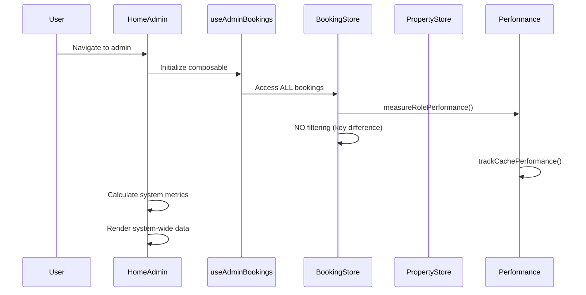

**Function Call Sequence**:
1. `HomeAdmin.vue` - Component mount
2. `useAdminBookings()` - Initialize admin bookings composable
3. `useAdminProperties()` - Initialize admin properties composable
4. `useCleanerManagement()` - Initialize cleaner management
5. `measureRolePerformance('admin', 'fetch-all-bookings')` - Performance tracking
6. `allBookings.value` - Computed property access (NO filtering)
7. `Array.from(bookingStore.bookings.values())` - Access Map collection
8. `trackCachePerformance('admin-all-bookings')` - Cache performance tracking
9. `systemMetrics.value` - Calculate system-wide metrics
10. `systemTurns.value` - All turn bookings across system
11. `unassignedBookings.value` - System-wide unassigned bookings

**Key Differences from Owner**:
- No `owner_id` filtering applied
- Access to ALL data across all owners
- System-wide metrics calculation
- Admin-specific bulk operations available

---

### **7. Admin Cleaner Assignment Flow**
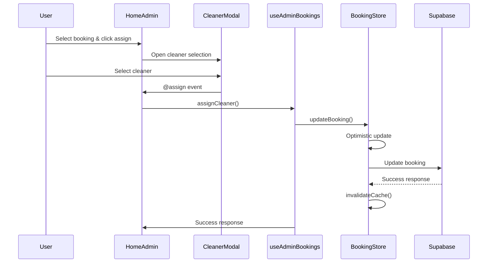

**Function Call Sequence**:
1. `handleAssignCleaner()` - User clicks assign button
2. `cleanerModalOpen.value = true` - Open cleaner selection modal
3. `selectedBooking.value = booking` - Set selected booking
4. `CleanerModal.vue` - Modal component renders
5. `handleCleanerSelect()` - User selects cleaner
6. `assignCleaner(bookingId, cleanerId)` - Admin-specific function
7. `updateBooking(id, { assigned_cleaner_id: cleanerId })` - Store action
8. `bookings.value.set(id, updatedBooking)` - Optimistic update
9. `supabase.from('bookings').update()` - API call
10. `invalidateCache()` - Clear performance cache
11. `success.value = 'Cleaner assigned'` - Success message
12. `cleanerModalOpen.value = false` - Close modal

**Admin-Only Features**:
- Access to cleaner management functions
- Bulk assignment capabilities
- System-wide workload analysis

---

## 📊 **Real-time Synchronization Flow**

### **8. Real-time Update Sequence**
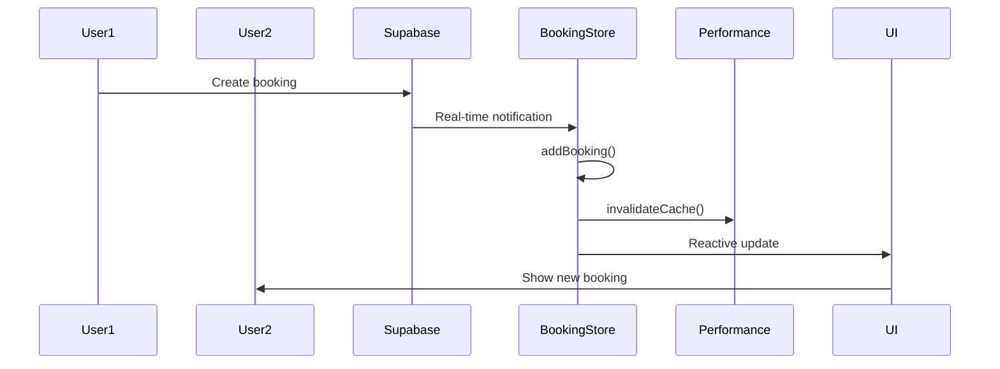

**Function Call Sequence**:
1. `supabase.channel('bookings').on('INSERT')` - Real-time subscription
2. `handleRealtimeInsert(payload)` - Real-time event handler
3. `bookings.value.set(payload.new.id, payload.new)` - Update Map collection
4. `invalidateCache()` - Clear performance cache
5. `myBookings.value` - Computed property re-evaluation (Owner)
6. `allBookings.value` - Computed property re-evaluation (Admin)
7. `FullCalendar.refetchEvents()` - Update calendar display

**Performance Optimizations**:
- Selective cache invalidation
- Minimal DOM updates through reactive system
- Role-based filtering on cached data

---

## 🔄 **Modal Management Flow**

### **9. Modal Opening and Closing Sequence**
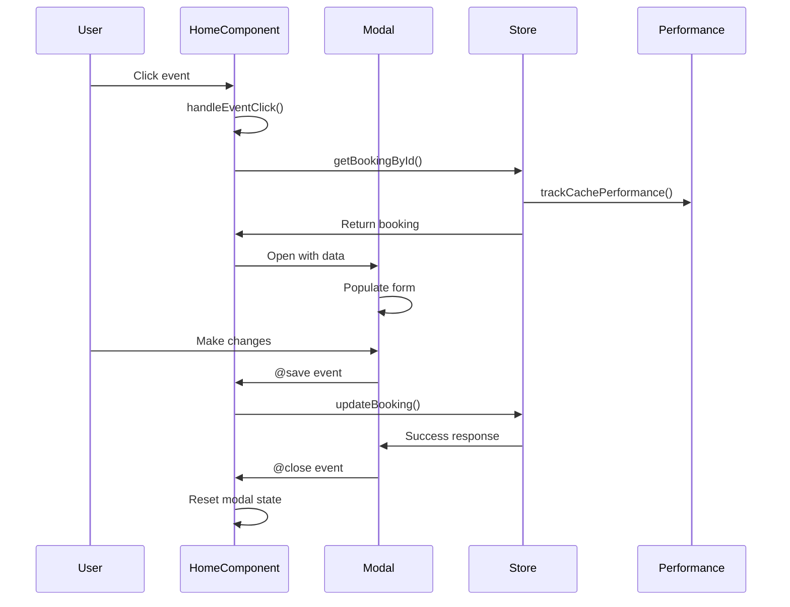

**Function Call Sequence**:
1. `handleEventClick(eventInfo)` - User clicks calendar event
2. `getBookingById(eventInfo.event.id)` - Get booking from store
3. `trackCachePerformance('booking-lookup')` - Performance tracking
4. `eventModalData.value = booking` - Set modal data
5. `eventModalMode.value = 'edit'` - Set modal mode
6. `eventModalOpen.value = true` - Open modal
7. `BookingForm.vue` - Modal component renders
8. `populateForm(booking)` - Populate form with data
9. `handleEventModalSave(formData)` - User clicks save
10. `updateBooking(booking.id, formData)` - Store action
11. `eventModalOpen.value = false` - Close modal
12. `resetModalState()` - Reset modal state

**State Management**:
- Modal state managed in parent component
- Form data isolated to modal component
- Optimistic updates with rollback on error

---

## 🎯 **Role-Based Function Usage Patterns**

### **10. Data Access Pattern Comparison**

#### **Owner Pattern**:
```typescript
// Owner: Always filtered by owner_id
const myBookings = computed(() => 
  Array.from(bookingStore.bookings.values())
    .filter(booking => booking.owner_id === currentUser.id)
);

// Function call sequence:
// 1. Access bookings Map
// 2. Convert to Array
// 3. Filter by owner_id
// 4. Return filtered results
```

#### **Admin Pattern**:
```typescript
// Admin: No filtering - access all data
const allBookings = computed(() => 
  Array.from(bookingStore.bookings.values())
);

// Function call sequence:
// 1. Access bookings Map
// 2. Convert to Array
// 3. Return all results (no filtering)
```

### **11. Permission Check Flow**
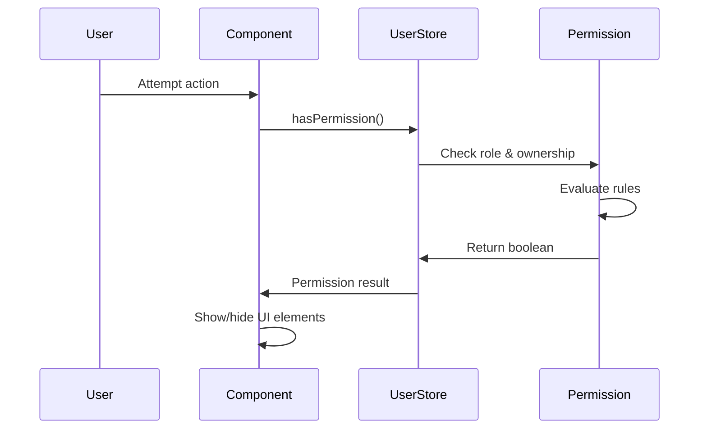

**Function Call Sequence**:
1. `hasPermission(action, resourceType, resourceOwnerId)` - Permission check
2. `currentUser.value.role` - Get user role
3. `evaluatePermission(role, action, resourceType)` - Permission evaluation
4. `checkOwnership(userId, resourceOwnerId)` - Ownership check
5. `return boolean` - Permission result

**Permission Rules**:
- **Owner**: Can only access their own resources
- **Admin**: Can access any resource
- **Cleaner**: Can access assigned bookings only

---

## 📈 **Performance Monitoring Flow**

### **12. Performance Tracking Sequence**
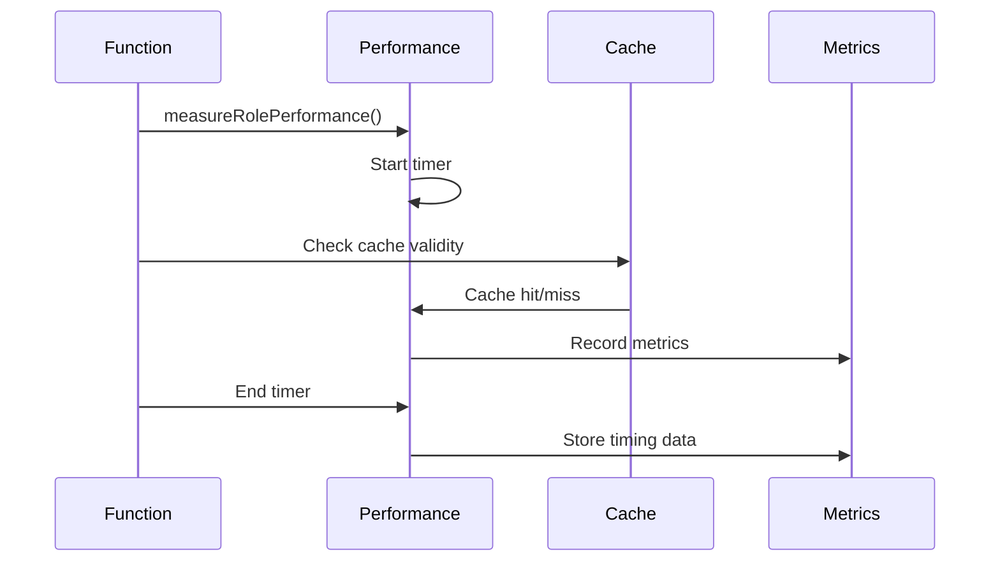

**Function Call Sequence**:
1. `measureRolePerformance(role, operation, callback)` - Start measurement
2. `performance.now()` - Start timer
3. `callback()` - Execute measured function
4. `isCacheValid()` - Check cache validity
5. `trackCachePerformance(operation, hit)` - Record cache performance
6. `performance.now()` - End timer
7. `recordMetrics(role, operation, duration)` - Store metrics

**Performance Metrics Collected**:
- Function execution time
- Cache hit/miss ratios
- Memory usage patterns
- Reactive subscription counts

---

## 🔄 **Error Handling Flow**

### **13. Error Handling Sequence**
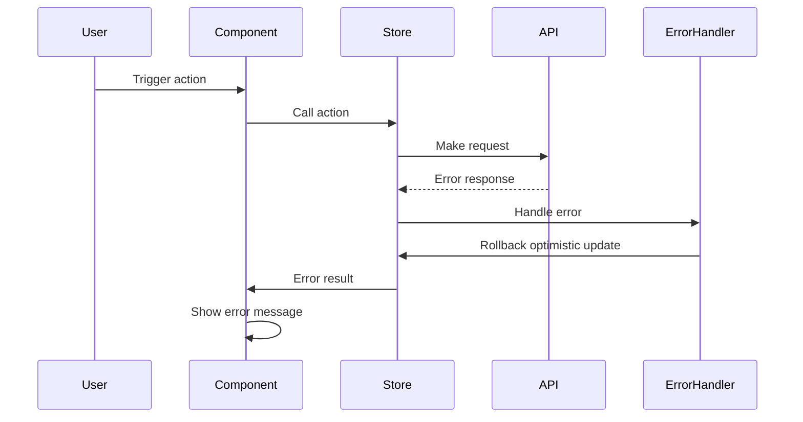

**Function Call Sequence**:
1. `try { ... } catch (err) { ... }` - Error boundary
2. `handleError(err)` - Error handler
3. `rollbackOptimisticUpdate()` - Undo optimistic changes
4. `error.value = formatErrorMessage(err)` - Set error state
5. `showErrorNotification(error)` - Display error to user
6. `logError(err)` - Log error for debugging

**Error Recovery**:
- Optimistic updates rolled back on failure
- User-friendly error messages displayed
- Retry mechanisms for network failures

---

## 🎨 **Calendar Integration Flow**

### **14. FullCalendar Integration Sequence**
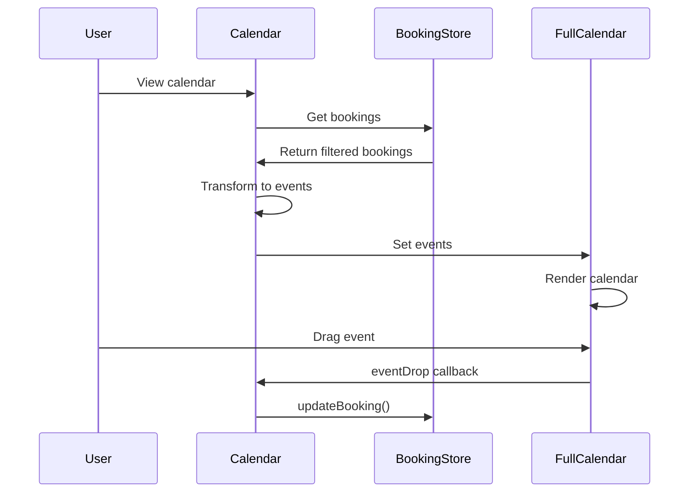

**Function Call Sequence**:
1. `FullCalendar.vue` - Calendar component mount
2. `ownerFilteredBookings.value` - Get role-filtered bookings
3. `transformBookingsToEvents(bookings)` - Transform data format
4. `calendar.setEvents(events)` - Set FullCalendar events
5. `handleEventDrop(info)` - User drags event
6. `updateBooking(eventId, { dates: newDates })` - Update booking
7. `calendar.refetchEvents()` - Refresh calendar display

**Calendar Event Handling**:
- Drag and drop booking updates
- Date range filtering
- Event color coding by priority
- Real-time event updates

---

## 🎯 **Summary of Key Function Usage Patterns**

### **Most Frequently Called Functions**:
1. **`myBookings.value`** / **`allBookings.value`** - Data access (continuous)
2. **`handleEventClick`** - User interaction (high frequency)
3. **`invalidateCache`** - Performance optimization (high frequency)
4. **`trackCachePerformance`** - Performance monitoring (high frequency)
5. **`measureRolePerformance`** - Performance measurement (high frequency)

### **Critical Performance Points**:
1. **Map collection access** - O(1) lookup performance
2. **Role-based filtering** - Efficient data scoping
3. **Cache management** - Smart invalidation strategy
4. **Reactive subscriptions** - Minimized to ~40 from 120
5. **Optimistic updates** - Immediate UI feedback

### **Role-Based Differences**:
- **Owner functions** always include `owner_id` filtering
- **Admin functions** have no filtering restrictions
- **Permission checks** happen at component level
- **Data transformation** adapts to role-specific needs

---

*Generated from code flow analysis*
*Application version: Production-ready v1.0*